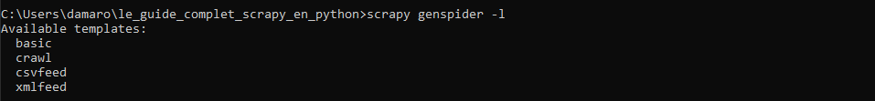
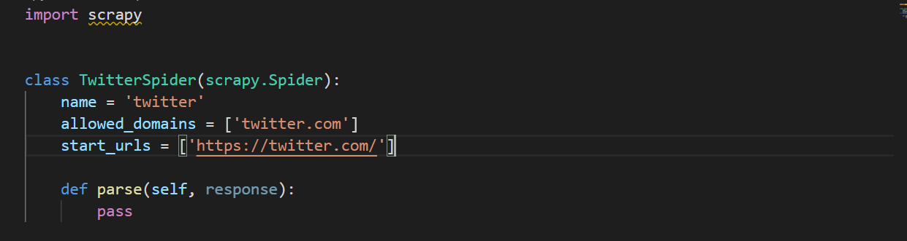
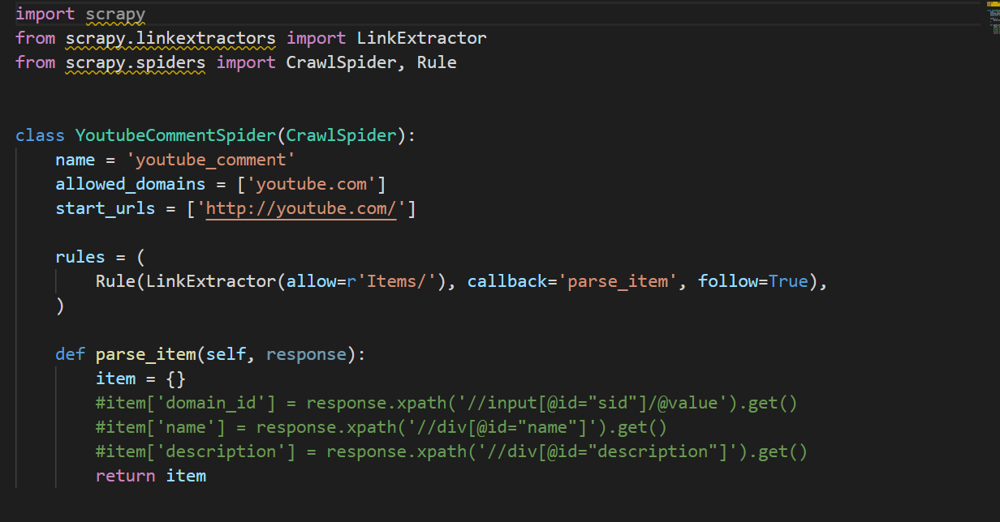

# Le Guide Complet Scrapy En Python

Le guide complet du framework scrapy en python 

## Type de Projet

Pour afficher les differents types de projet scrapy

<pre>
<code>
    scrapy genspider -l
</code>
</pre>

## Créer Un Projet Avec Un Template Basic

Si on ne spécifie rien, c'est le projet de type **basic** qui va être généré.

Exemple:

<pre>
<code>
    scrapy genspider twitter twitter.com
</code>
</pre>

* **twitter**: indique ici qu'on veut générer un projet du nom de twitter
*  **twitter.com**: indique ici qu'on veut récupérer les données à partir de twitter.com

## Créer Un Projet Avec Un Template Spécifique

Exemple:

<pre>
<code>
    scrapy genspider -t crawl youtube_comment youtube.com
</code>
</pre>

* **-t**: est l'option qui nous permet d'indiquer le template

## Crawl Spider

Concentrons-nous sur **Crawl Spider**:

* **name**: nous indique le nom de compilation de la classe
* **allow_domains**: nous les domains à scraper ou analyser
* **start_urls**: les urls de demarrages
* **rules**: contient les classes **LinkExtractor**